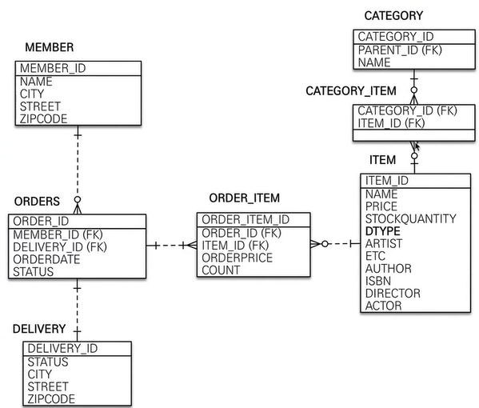
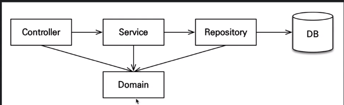

# jpaShop
Springboot와 jpa를 활용하여 jpaShop 프로젝트(bookstore 예제)  

# start.spring.io 에서 프로젝트 생성
##### project : Gradle Project  
##### Language : Java  
##### Spring Boot : 2.6.7 version  
##### Packaging : Jar  
##### Dependencies : SpringWeb, Thymeleaf, Spring Data JPA, H2 Database, Lombok  

# View 환경설정  
static - 정적 컨텐츠는 이 경로에  
templates - 템플릿 엔진으로 렌더링이 필요할경우

# 테이블 설계

# 어플리케이션 아키텍처

#### cotroller, web : 웹계층
#### service : 비즈니스 로직, 트랜젝션 처리
#### repository : JPA를 직접 사용하는 계층, 엔티티 매니저 사용
#### domain : 엔티티가 모여 있는 계층 ,모든 계층에서 사용